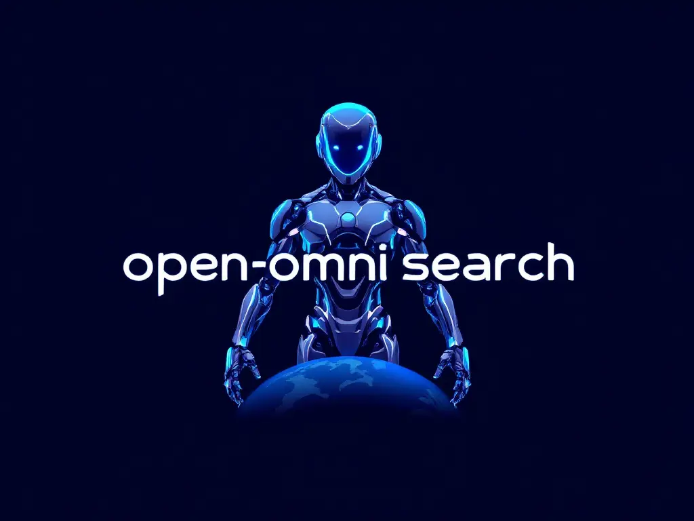
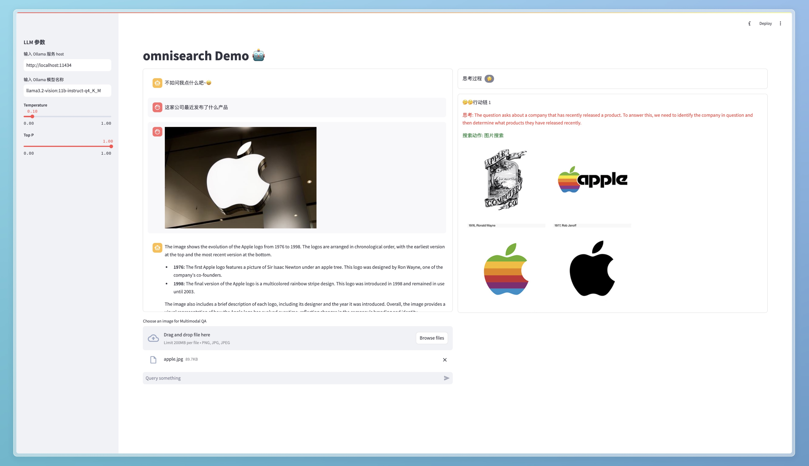

<div align="center">

</div>

# Open-OmniSearch

This project is inspired by the [OmniSearch](https://github.com/Alibaba-NLP/OmniSearch), 
and implements it with open-source Ollama multimodal LLMs and DuckDuckGo search service. 

> OmniSearch, a self-adaptive retrieval agent that plans each retrieval action in real-time according to question solution stage and current retrieval content.

# Dependencies

```bash
pip install -r requirement.txt
```

#### Details

- duckduckgo_search==6.3.5
- jieba==0.42.1
- loguru==0.7.2
- nltk==3.9.1
- ollama==0.4.1
- Pillow==11.0.0
- python-dotenv==1.0.1
- PyYAML==6.0.2
- Requests==2.32.3
- streamlit==1.40.1
- streamlit_extras==0.5.0
- tqdm==4.67.0


# Demo


```bash
streamlit run app.py
```

## 🫶Acknowledgements
- [OmniSearch](https://github.com/Alibaba-NLP/OmniSearch)
