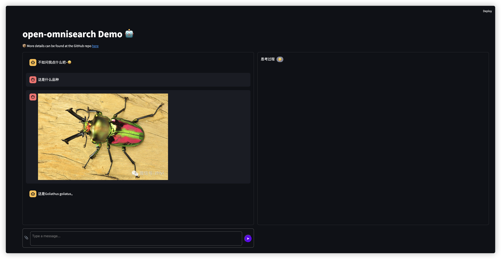

<div align="center">

</div>

# Open-OmniSearch

This project is inspired by the [OmniSearch](https://github.com/Alibaba-NLP/OmniSearch), 
and implements it with open-source Ollama multimodal LLMs and DuckDuckGo search service. 

> OmniSearch, a self-adaptive retrieval agent that plans each retrieval action in real-time according to question solution stage and current retrieval content.

# Dependencies

```bash
pip install -r requirement.txt
```

#### Details

- duckduckgo_search = 6.3.5
- loguru = 0.7.2
- ollama = 0.3.3
- Pillow = 11.0.0
- python-dotenv = 1.0.1
- Requests = 2.32.3
- tqdm = 4.67.0


# Demo


The Thinking Process module is still under development

```bash
streamlit run app.py
```

## 🫶Acknowledgements
- [OmniSearch](https://github.com/Alibaba-NLP/OmniSearch)
